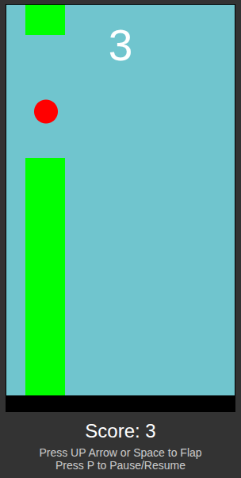

# js_flappybird

### Play it now: https://pemmyz.github.io/js_flappybird/

# Flappy Bird Clone in JavaScript/HTML5

This is a simple Flappy Bird-style game implemented using JavaScript/HTML5. The player controls a red bird that must navigate through an endless series of pipes by flapping to avoid collisions.

## 🖥️ Screenshots

### Game

## 🎮 Gameplay

- Press the **Up arrow key** or click mouse button 1 in game area, to make the bird flap.
- Avoid hitting the green pipes or the ground/ceiling.
- The game ends if the bird hits a pipe or touches the top or bottom of the screen.
- The score increases each time you pass a pipe.

---

## 🤖 Auto Modes

The game includes two automated modes that can be toggled:

| Mode           | Description |
|----------------|-------------|
| 🕹️ Demo Mode    | Automatically plays a sample round after inactivity. Useful as an idle screen or attract mode. |
| 🤖 Bot Mode     | Activates an AI that attempts to play the game intelligently by flapping at optimal times. |

- Wait 5 seconds to toggle **Demo Mode** when game is reloaded
- Press `B` to toggle **Bot Mode**
- Both modes display a label on screen when active

## 🚦 Difficulty Modes

The game includes three selectable difficulty modes that affect the **pipe gap shrinking rate**:

| Difficulty      | Description                                                | Pipe Gap Behavior                         |
|----------------|------------------------------------------------------------|-------------------------------------------|
| 🟢 Normal       | Balanced for casual play                                   | Constant pipe gap (no shrinking).         |
| 🔴 Hard         | More challenging; pipes narrow over time                   | Pipe gap shrinks by **2px** per score.    |
| 🔥 Extra Hard   | Intense mode for skilled players                           | Pipe gap shrinks by **5px** per score.    |

### 🔁 Switching Difficulty

- Press `N` before or during gameplay to cycle through the difficulty modes.
- The selected mode is shown on screen.
- The difficulty change applies to the next game if done during Game Over or idle state.

---

## 📐 Technical Details

- **Initial Pipe Gap**: 155 pixels
- **Minimum Pipe Gap**: ~52 pixels (based on bird size)
- The pipe gap decreases **only after each successful pipe pass**, making progression harder as your score increases.

## 📺 UI Elements

- **Score Display** updates on both the canvas and DOM.
- **Difficulty Label** shows current mode:  
  `"Difficulty: Normal (Press N to change)"`
- On-screen indicators show when **Demo Mode** or **Bot Mode** is active.
  
## 📱 Mobile Support

- Tap/click anywhere on the canvas to flap.

---

## 🛠️ Features

- Simple and clean implementation using JavaScript/HTML5  
- Score tracking  
- Gravity and flap mechanics  
- Collision detection with pipes and screen bounds  
- Randomized pipe gap positions for variety  
- **Selectable difficulty levels**
- **Automatic demo mode**  
- **Automatic bot mode (AI player)**  
- Mobile-friendly: Tap to flap  

## ✅ To Do

- Add sound effects and background music  
- Add a start menu and game over screen  
- Improve graphics with images or sprites  
- High score saving

